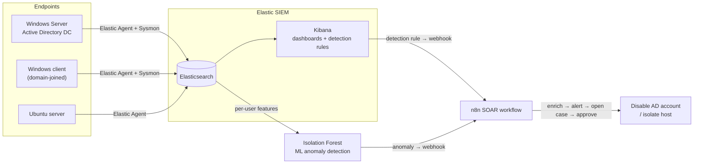

# 🛡️ Insider-Threat Detection & Automated Response Lab

> A home-lab SOC pipeline that detects **insider-threat** behaviour across Windows / Active Directory and Linux, and **responds automatically** — built with **Elastic SIEM**, an **Isolation Forest** ML model, and an **n8n SOAR** workflow.


---

## Overview

This project recreates how a modern Security Operations Centre (SOC) catches and contains **insider threats** — malicious or compromised internal users. Telemetry from Windows/AD and Linux endpoints is shipped into an **Elastic SIEM**, where threats are caught two complementary ways:

- **Detection engineering** — hand-written, version-controlled detection rules (detection-as-code).
- **Machine learning** — an unsupervised **Isolation Forest** that scores each user's behaviour and flags anomalies no static rule would catch.

When either path fires, a **SOAR workflow in n8n** runs the response: it enriches the alert, notifies the SOC, opens a case, and — on analyst approval — **disables the offending Active Directory account**.

It demonstrates the full **detect → enrich → decide → respond** loop that real blue teams run, end to end.

## Architecture



## What it detects

| Scenario | Signal | Windows event(s) | MITRE ATT&CK |
|---|---|---|---|
| Brute force / password spray | ≥ 8 failed logons for one user in 5 min | 4625 | T1110 |
| Account lockout | repeated bad passwords | 4740 | T1110 |
| Successful logon after repeated failures | failures → success (EQL sequence) | 4625 → 4624 | T1110 |
| Windows Security log cleared | anti-forensics / evasion | 1102 | T1070.001 |
| User added to a privileged group | privilege escalation / persistence | 4728 / 4732 / 4756 | T1098 |
| New user account created | rogue-account persistence | 4720 | T1136 |
| Anomalous user behaviour | off-hours access, lateral movement, spikes | ML (Isolation Forest) | T1078 |

Rules are shipped as code in [`detections/`](detections/) and imported straight into Kibana.

## The ML layer — why Isolation Forest

Insider threats are **rare and unlabelled**, so a supervised classifier has nothing to learn from. Isolation Forest is unsupervised: it isolates points that are "few and different" — exactly what an insider looks like against a baseline of normal users, with no labelled attack data required.

The detector pulls per-user features from Elasticsearch (failed-logon ratio, distinct hosts, off-hours logons, privilege events, lockouts…), scores every user, and pushes the outliers to the SOAR workflow. Code + write-up in [`ml/`](ml/).

```
user        failed_ratio  distinct_hosts  off_hours  priv_events   anomaly_score  is_anomaly
svc_backup       0.12            9             6           5           0.7505         True   ← lateral movement
j.doe            0.91            1             3           0           0.7346         True   ← brute force
admin_tmp        0.00            6             2           3           0.6907         True   ← new privileged account
...normal users...                                                    ~0.43           False
```

## The SOAR automation — n8n

The n8n workflow ([`n8n/`](n8n/)) is the response brain:

**Webhook → Normalize → severity gate → enrich source IP (geo/ISP) → notify SOC → open case → [approval] → disable AD account**

Both detection paths — the Elastic rules and the ML model — POST into the same webhook, so every alert converges on one consistent response. A `severity == high` gate and a human-approval step keep the destructive "disable account" action safe.

## Tech stack

Elasticsearch · Kibana · Elastic Agent + Fleet · Sysmon · Windows Server / Active Directory · Ubuntu Server · Python (pandas, scikit-learn) · n8n · VirtualBox

> In a real SOC the response layer would be a dedicated SOAR platform (Cortex XSOAR, Splunk SOAR, Tines, or the open-source Shuffle). n8n is used here as a modern, API-first, self-hostable stand-in that demonstrates the same concepts.

## Repository structure

```
siem-insider-threat/
├─ README.md                  ← you are here
├─ ROADMAP.md                 ← the build plan
├─ detections/                ← Elastic detection rules (detection-as-code)
│  ├─ insider-threat-rules.ndjson
│  └─ README.md
├─ ml/                        ← Isolation Forest anomaly detector
│  ├─ insider_threat_detector.py
│  ├─ requirements.txt
│  └─ README.md
├─ n8n/                       ← SOAR response workflow
│  ├─ insider-threat-workflow.json
│  └─ README.md
└─ docs/                      ← architecture diagram + screenshots
```

## Reproduce it

1. **SIEM** — Elasticsearch + Kibana + Fleet, with the System & Windows integrations shipping logs into `logs-*`.
2. **Detections** — import [`detections/insider-threat-rules.ndjson`](detections/) into Kibana → Security → Rules.
3. **ML** — `pip install -r ml/requirements.txt` then `python ml/insider_threat_detector.py --mode demo` (see [`ml/README.md`](ml/)).
4. **SOAR** — run n8n (Docker) and import [`n8n/insider-threat-workflow.json`](n8n/); point the Elastic Webhook connector and the ML detector at its webhook.

Full step-by-step in [`ROADMAP.md`](ROADMAP.md).

## Screenshots

| Detection rules (Kibana) | SOAR workflow (n8n) |
|---|---|
|  |  |

## Roadmap

- [x] Elastic SIEM + endpoint log ingestion
- [x] Detection rules as code (imported & running)
- [x] Isolation Forest ML anomaly detection
- [x] n8n SOAR workflow — tested end-to-end (detect → enrich → alert)
- [ ] Active Directory Domain Controller — makes the AD detections & auto-disable live
- [ ] Manual-approval gate before the account-disable action
- [ ] Kibana dashboard for insider-threat KPIs

## Lessons learned

- **Two detection layers beat one** — static rules catch the known-bad; ML surfaces the weird-but-unseen.
- **Detection-as-code** makes rules reviewable, diffable, and portable across environments.
- **Keep a human in the loop** for destructive response — automate the toil, gate the irreversible.

## Disclaimer

Built and run entirely in an isolated VirtualBox lab for learning and portfolio purposes. The auto-disable action and `--insecure`/no-TLS settings are lab conveniences and must never be pointed at production identities.
